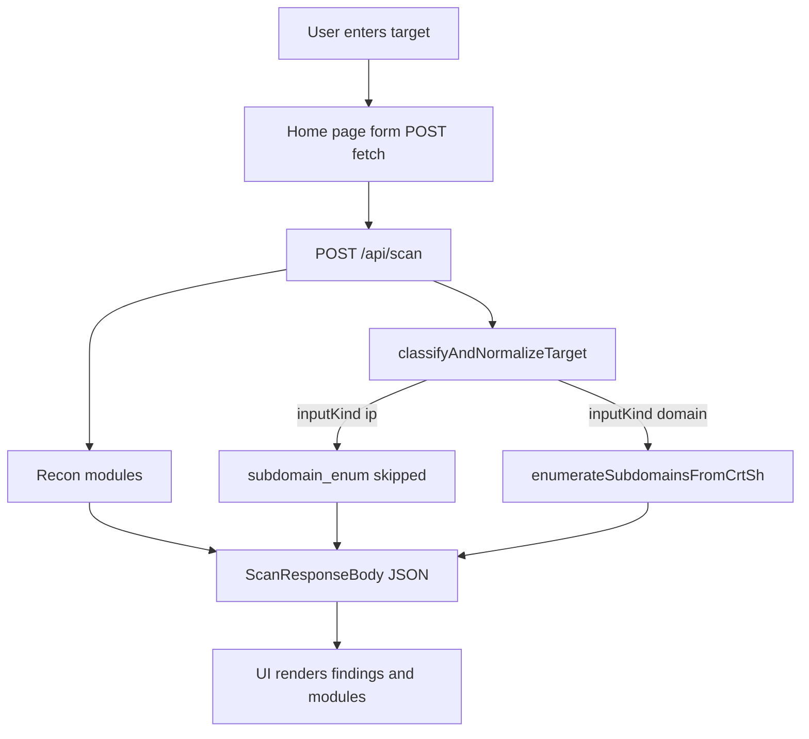

# Architecture

## Stack

- **Next.js** (App Router) + **TypeScript**
- **Tailwind CSS** v4
- **React 19**

Key entry points:

| Area | Path |
|------|------|
| Home / scan form UI | [`src/app/page.tsx`](../src/app/page.tsx) |
| Scan API | [`src/app/api/scan/route.ts`](../src/app/api/scan/route.ts) |
| Target parsing | [`src/lib/recon/normalize-target.ts`](../src/lib/recon/normalize-target.ts) |
| Subdomain recon | [`src/lib/recon/subdomains.ts`](../src/lib/recon/subdomains.ts) |
| Shared types | [`src/types/scan.ts`](../src/types/scan.ts) |

## Request flow

## Scan pipeline (today)

1. **Parse JSON body** — invalid JSON → `400` + `"Invalid JSON body."`.
2. **Extract `target`** string (or treat as empty).
3. **`classifyAndNormalizeTarget`** — if `unknown` or empty → `400` with user-facing message.
4. **Branch on `inputKind`:**
   - **`ip`**: append one `ScanModuleResult` for `subdomain_enum` with `status: "skipped"` and explanation; **no** crt.sh call; `findings` stays empty.
   - **`domain`**: call `enumerateSubdomainsFromCrtSh(normalized)`; merge returned `ScanFinding[]` into `findings`; record module `ok` or `error` with `durationMs` / `errorMessage`.
5. **Return** `ScanResponseBody` as JSON.

## UI behavior

- Client component posts `{ target }` to `/api/scan`.
- On success, renders **Modules** list and **Findings** list; hostname metadata may show first **200** names with total count (see `subdomains.ts`).

## Future shape (not implemented)

[CONTEXT.md](../CONTEXT.md) and [init.md](../init.md) describe **parallel modules** and **streaming** partial results. The current codebase returns **one** JSON payload per request; extending this would likely mean Server-Sent Events, chunked responses, or polling — not present yet.

## Related

- [API reference](api-reference.md)
- [Recon modules](recon-modules.md)
